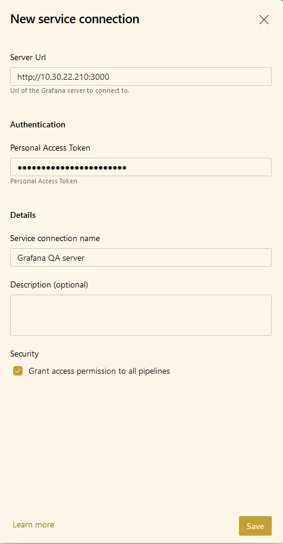
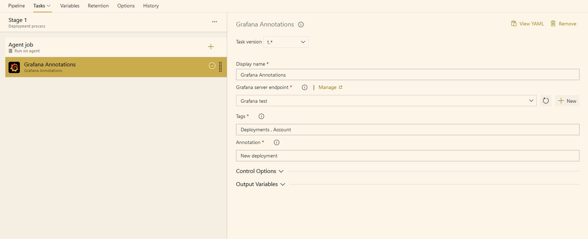

# Grafana Annotations-AzureDevops-and-VSTS-extension

Summary  
Adding a Grafana annotations extensions for Azure Devops

## Release Notes

1.0.0
	- First release
1.0.10
	- Release ready.

## What’s the problem

When needing to add an annotations to Grafana once a release is finished. 

## Solution

The Release task allow you to add a service connection with the following

* Endpoint - The Grafana URL ( will be concat later with api/Annotations )

* APIkey - The Admin API key generated from Grafana

## Usage

Installs using the following:

* A Grafana API endpoint with Token based authentication scheme for connecting securely to your Grafana server
* A cross platform (Windows/Mac/Linux) build/release task for creating a tag in Grafana for any application.

Steps:

1. Create a Grafana API Endpoint:

2. Open your build/release definition and add the Grafana task.

The task can be found in the Deploy category of the Add Tasks dialog. 
Enter the required parameter values for the task:

1. Tags- Mandatory Field
2. Annotation- Mandatory Field
